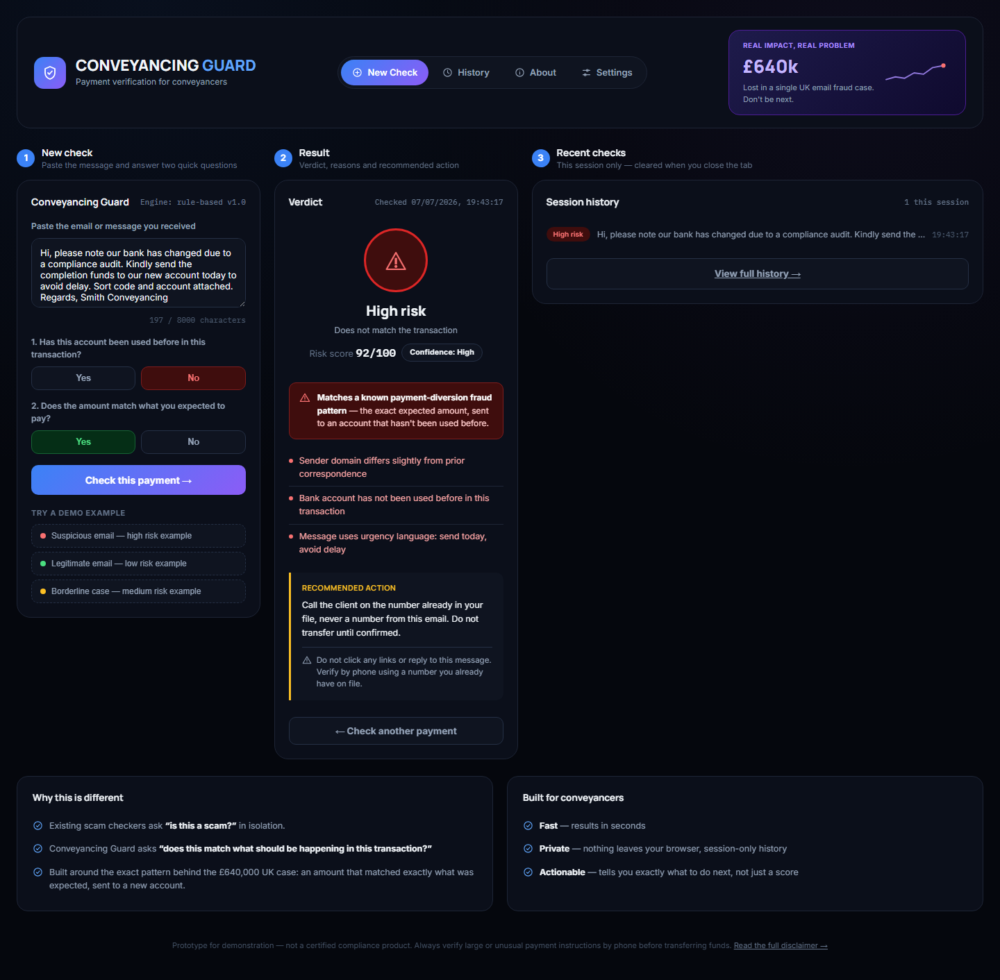
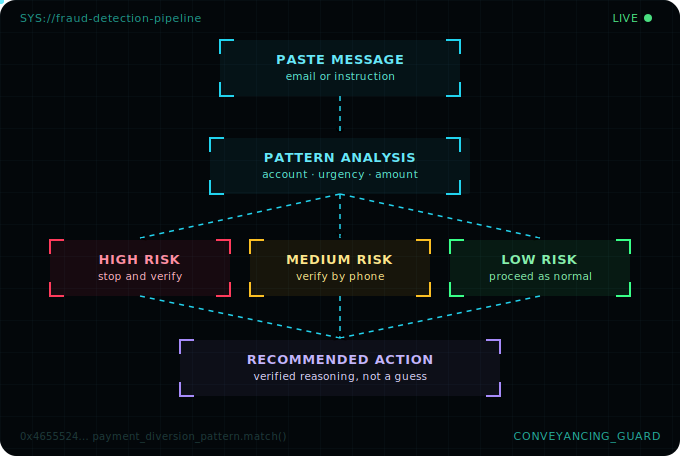
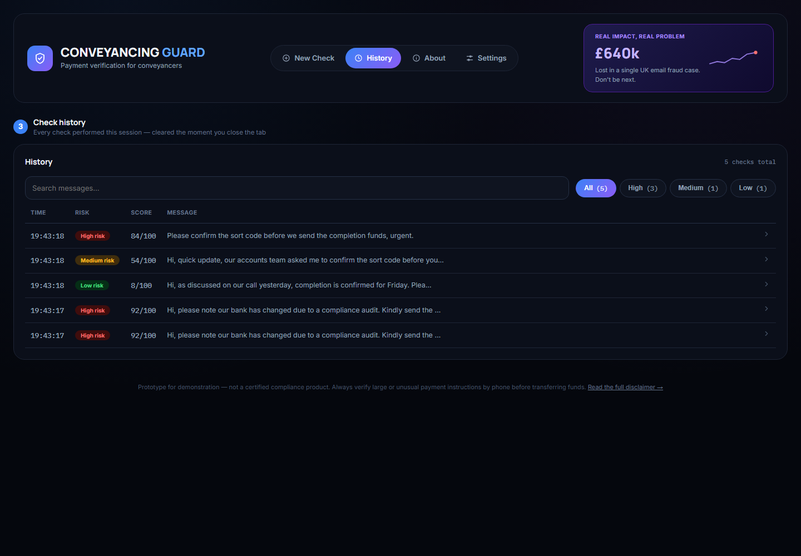
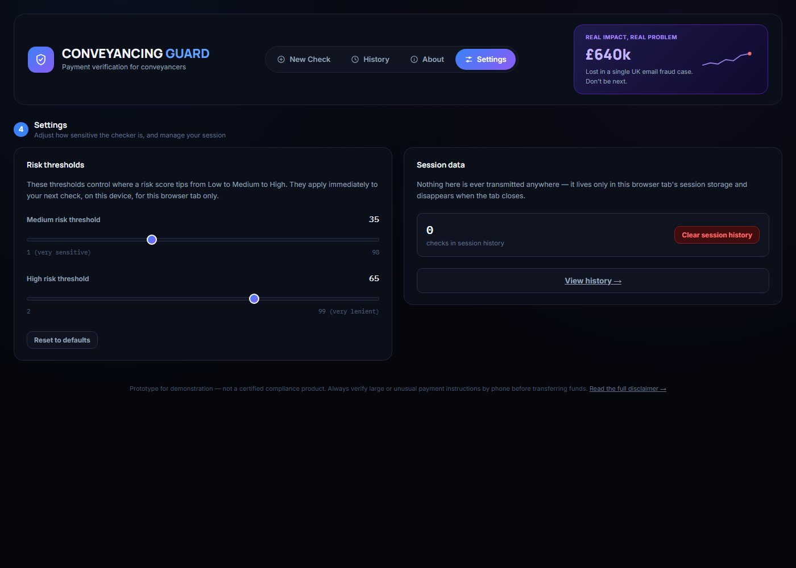
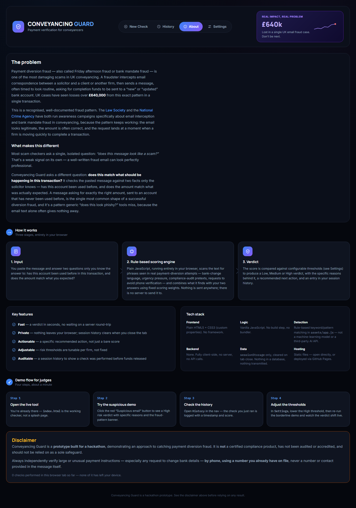

<div align="center">

# 🛡️ Conveyancing Guard

**A rule-based payment fraud checker for UK conveyancing solicitors — built to catch payment diversion fraud before funds are sent.**

[](LICENSE)
[](#disclaimer)
[](#tech-stack)
[](#tech-stack)
[](#tech-stack)

**[▶ Try it live](#)** &nbsp;·&nbsp; link goes live once GitHub Pages is enabled for this repo

</div>

<br/>



<br/>

## Table of contents

- [The problem](#the-problem)
- [What makes this different](#what-makes-this-different)
- [System architecture](#system-architecture)
- [How it works](#how-it-works)
- [Features](#features)
- [Screenshots](#screenshots)
- [Tech stack](#tech-stack)
- [Project structure](#project-structure)
- [Getting started](#getting-started)
- [Known limitations](#known-limitations)
- [Disclaimer](#disclaimer)
- [License](#license)

<br/>

## The problem

Payment diversion fraud — also called *Friday afternoon fraud* or *bank mandate fraud* — is one of the most damaging scams in UK conveyancing. A fraudster intercepts email correspondence between a solicitor and a client or another firm, then sends a message, often timed to look routine, asking for completion funds to be sent to a "new" or "updated" bank account.

> **UK cases have seen losses over £640,000 from this exact pattern — in a single transaction.**

This is a recognised, well-documented fraud pattern. The [Law Society](https://www.lawsociety.org.uk/) and the [National Crime Agency](https://www.nationalcrimeagency.gov.uk/) have both run awareness campaigns specifically about email interception and bank mandate fraud in conveyancing, because the pattern keeps working: the email looks legitimate, the amount is often correct, and the request lands at a moment when a firm is moving quickly to complete a transaction.

## What makes this different

Most scam checkers ask a single, isolated question: *"does this message look like a scam?"* That's a weak signal on its own — a well-written fraud email can look perfectly professional.

Conveyancing Guard asks a different question:

> ### Does this match what should be happening in this transaction?

It checks the pasted message against two facts only the solicitor knows:

| Question | Why it matters |
|---|---|
| **Has this account been used before** in this transaction? | Diverted funds almost always go to an account that has never appeared in the transaction before. |
| **Does the amount match** what was actually expected? | A correct amount sent to the wrong account is the classic shape of a successful diversion fraud — the content alone won't flag it. |

A message asking for exactly the right amount, sent to an account that has never been used before, is the single most common shape of a successful diversion fraud — and it's a pattern that generic "does this look phishy?" tools miss entirely, because the email text alone often gives nothing away.

<br/>

## System architecture

The entire pipeline runs client-side, in the browser — there is no server in this diagram because there is no server in the product.



```
 ┌──────────────┐     ┌────────────────────┐     ┌───────────────────────────────┐     ┌─────────────────────┐
 │ Paste message │ ──▶ │ Rule-based scoring  │ ──▶ │  Verdict: High / Medium / Low  │ ──▶ │ Recommended action   │
 │ + 2 answers    │     │ engine (in-browser) │     │  + score + specific reasons   │     │ + session history log│
 └──────────────┘     └────────────────────┘     └───────────────────────────────┘     └─────────────────────┘
```

## How it works

1. **Input** — paste the message and answer two questions only you know the answer to: *has this account been used before in this transaction*, and *does the amount match what you expected?*
2. **Rule-based scoring engine** — plain JavaScript, running entirely in your browser, scans the text for phrases seen in real payment-diversion attempts (bank-change language, urgency pressure, compliance-audit pretexts, requests to avoid phone verification) and combines what it finds with your two answers using fixed scoring weights. Nothing is sent anywhere — there is no server to send it to.
3. **Verdict** — the score is compared against configurable thresholds (see [Settings](settings.html)) to produce a **Low / Medium / High** verdict, the specific reasons behind it, a recommended next action, and an entry in your session history.

<br/>

## Features

| | |
|---|---|
| ⚡ **Fast** | A verdict in seconds — no server round-trip |
| 🔒 **Private** | Nothing leaves your browser; history clears when you close the tab |
| 🎯 **Actionable** | A specific recommended action, not just a bare score |
| 🎚️ **Adjustable** | Risk thresholds are tunable per firm, not hardcoded |
| 🧾 **Auditable** | A searchable session history proves a check was performed before funds released |
| 🚩 **Pattern-aware** | Flags the classic diversion shape — right amount, unused account — with its own banner |

## Screenshots

<table>
<tr>
<td width="50%">

<p align="center"><sub>Searchable, filterable session history</sub></p>
</td>
<td width="50%">

<p align="center"><sub>Live-adjustable risk thresholds</sub></p>
</td>
</tr>
</table>

<details>
<summary><strong>About page (problem, architecture, tech stack, disclaimer)</strong></summary>
<br/>

</details>

<br/>

## Tech stack

| Layer | Technology | Notes |
|---|---|---|
| Frontend | HTML5 + CSS3 (custom properties) | No framework |
| Logic | Vanilla JavaScript | No build step, no bundler |
| Detection | Rule-based keyword / pattern matching (`assets/app.js`) | Not a machine-learning model or a third-party AI API |
| Backend | — | None. Fully client-side, no API calls |
| Data | `sessionStorage` | Cleared on tab close — nothing in a database, nothing transmitted |
| Hosting | Static files | Open directly, or deploy via GitHub Pages |

## Project structure

```
conveyancing-guard/
├── index.html                  New Check — the live entry point
├── history.html                 Search, filter and paginate session checks
├── about.html                    Problem, architecture, tech stack, disclaimer
├── settings.html                  Adjustable risk thresholds, clear history
├── assets/
│   ├── app.js                       Scoring engine, storage, page controllers
│   ├── styles.css                    Design tokens + shared component styles
│   ├── workflow.svg                   Architecture diagram used above
│   └── screenshots/                    Images used in this README
├── LICENSE
├── .gitignore
└── README.md
```

Four static pages share one stylesheet and one script — no `fetch()`-based includes, no ES modules — so every page works identically whether it's opened by double-clicking the file or served over GitHub Pages.

## Getting started

This is a static site. There is nothing to install and nothing to build.

**Open directly**

Open `index.html` in any browser. `History`, `About`, and `Settings` are reachable from the nav bar on every page.

**Or serve locally**

```bash
python3 -m http.server
```

Then visit `http://localhost:8000`.

## Known limitations

This is a hackathon prototype, and these are deliberate, disclosed trade-offs — not oversights:

- Detection is rule-based keyword/pattern matching, not machine learning — it will miss novel phrasing it hasn't been tuned for.
- History and settings live in `sessionStorage`, so they reset per browser tab and don't sync across devices.
- There is no authentication, multi-user support, or firm-wide audit trail — each session is independent.

<br/>

## Disclaimer

Conveyancing Guard is a **prototype built for a hackathon**, demonstrating an approach to catching payment diversion fraud. It is **not** a certified compliance product, has not been audited or accredited, and should not be relied on as a sole safeguard.

**Always independently verify large or unusual payment instructions** — especially any request to change bank details — **by phone, using a number you already have on file**, never a number or contact provided in the message itself.

## License

MIT — see [LICENSE](LICENSE).

<div align="center">
<sub>Built in response to a real £640,000 UK conveyancing fraud case.</sub>
</div>
